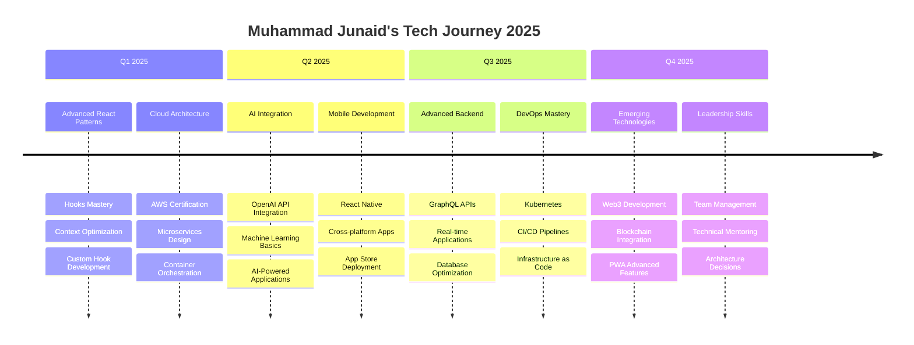

```mermaid
graph TD
    A[🔭 Currently Working On] --> B[🚀 Enterprise Web Applications]
    A --> C[☁️ Cloud Migration Projects]
    A --> D[🌐 Open Source Contributions]
    A --> E[📱 Mobile-First Development]
    
    F[🌱 Currently Learning] --> G[🤖 AI Integration in Web Apps]
    F --> H[☁️ Advanced Cloud Architecture]
    F --> I[⚡ Performance Optimization]
    F --> J[🔐 Advanced Security Practices]
    
    K[👯 Looking to Collaborate On] --> L[🌟 Innovative Open Source Projects]
    K --> M[🚀 Cutting-edge Web Applications]
    K --> N[🛠️ Developer Tools & Libraries]
    K --> O[🎯 High-impact Startups]
    
    P[🎯 2024 Goals] --> Q[📈 Contribute to 50+ Open Source Projects]
    P --> R[🏆 Launch 3 Major Applications]
    P --> S[📚 Master Advanced React Patterns]
    P --> T[☁️ Become AWS Certified]

    style A fill:#ff6b6b
    style F fill:#4ecdc4
    style K fill:#45b7d1
    style P fill:#96ceb4
```

# <div align="center"></div>

<div align="center">
  
</div>

<br/>

<div align="center">
  
</div>

<div align="center">
  
</div>

##  About Me


```javascript
const junaid = {
    location: "🏙️ Islamabad, Pakistan 🇵🇰",
    contact: "📞 +92-326-1710249",
    email: "📧 junaidch249249@gmail.com",
    experience: "🚀 3+ Years of Excellence",
    currentRole: "💼 Software Developer @ Codonomy",
    passion: "❤️ Building scalable web applications",
    motto: "✨ Clean code is poetry in motion",
    
    currentlyWorkingOn: [
        "🔥 Full-stack web applications",
        "🏢 Enterprise solutions",
        "🌐 Open source contributions",
        "🎯 Performance optimization"
    ],
    
    askMeAbout: [
        "⚛️ React/Next.js", "🔷 .NET", "🚀 Full-stack development",
        "🗄️ Database design", "🔌 API architecture", 
        "🧹 Clean code practices", "☁️ Cloud deployment"
    ],
    
    funFact: "⚽ I score goals on the field AND in code! 🥅💻",
    
    dailyRoutine: {
        morning: "☕ Coffee + Code Review",
        afternoon: "💻 Building awesome features",
        evening: "📚 Learning new technologies",
        night: "⚽ Football highlights"
    }
};

console.log("Welcome to Junaid's amazing world! 🌟");
```

<br/>

<div align="center">
  
</div>

## <b> Tech Stack & Skills </b>

<div align="center">
  
###  Frontend Technologies


###  Backend Technologies  


###  Databases & Storage


###  DevOps & Tools


</div>

<div align="center">
  
</div>

<br/>

<div align="center">
  
</div>

##  GitHub Statistics & Analytics

<div align="center">
  
  
  
  <br/><br/>
  
  
  
  
  <br/><br/>
  
  
  
  <br/><br/>
  
  
  
</div>

<br/>

<div align="center">
  
</div>

##  Contribution Snake Animation

<div align="center">
  <picture>
    <source media="(prefers-color-scheme: dark)" srcset="https://raw.githubusercontent.com/webdevjunaid/webdevjunaid/output/github-contribution-grid-snake-dark.svg">
    <source media="(prefers-color-scheme: light)" srcset="https://raw.githubusercontent.com/webdevjunaid/webdevjunaid/output/github-contribution-grid-snake.svg">
    
  </picture>
</div>

<br/>

<div align="center">
  
</div>

##  Professional Journey & Experience

<table>
<tr>
<td width="33%">

<div align="center">
  
  
### 🏢 Current Position
**Software Developer @ Codonomy**  
*July 2024 – Present*

- 🚀 Leading full-stack development
- ⚛️ React.js & .NET expert
- 🗄️ SQL Server database management
- 👥 Cross-functional team collaboration
- 🔄 Agile/Scrum methodology
- 📊 Performance optimization
</div>

</td>
<td width="33%">

<div align="center">
  
  
### 🌱 Internship Experience
**Software Development Intern**  
*April 2024 – June 2024*

- 🏥 Healthcare application development
- ⚛️ React frontend development
- 🔷 .NET backend implementation
- 🗄️ SQL query optimization
- 📋 Azure Boards collaboration
- 🎯 Agile development practices
</div>

</td>
<td width="33%">

<div align="center">
  
  
### 💼 Freelance Journey
**Full-Stack Developer**  
*January 2022 – February 2024*

- 💻 15+ custom applications built
- 🛒 E-commerce solutions
- 🏥 Healthcare platforms
- 🌐 Portfolio websites
- ☁️ Cloud deployments
- 💳 Payment integrations
</div>

</td>
</tr>
</table>

<br/>

<div align="center">
  
</div>

##  Featured Projects Showcase

<div align="center">
  
</div>

### 🐟 PJFarmersMarket - Premium Seafood E-commerce Platform
<div align="center">


</div>

🌟 **Features:**
- 🛒 Complete e-commerce solution with shopping cart
- 🔐 Secure user authentication & authorization  
- 💳 Integrated Stripe payment processing
- 📱 Fully responsive design across all devices
- ⚡ Lightning-fast performance with Next.js
- 🗄️ Real-time database with Supabase

---

### 🏥 PrecurePM - Advanced Medical Management System  
<div align="center">


</div>

🌟 **Features:**
- 📅 Advanced appointment scheduling system
- 🏥 Insurance claims management
- 👥 Role-based access control (RBAC)
- 📊 Real-time dashboard analytics
- 🔄 State management with Redux
- 🛡️ Enterprise-level security

---

### 💰 HoraceMann - Insurance Commission Calculator
<div align="center">


</div>

🌟 **Features:**
- 🧮 Complex commission calculation algorithms
- 📈 Performance optimization techniques
- 🔐 Secure API endpoints
- 📊 Detailed reporting system
- ⚡ High-performance backend architecture
- 🎯 99.9% calculation accuracy

<br/>

<div align="center">
  
</div>

##  Activity Graph & Contribution Insights

<div align="center">
  
</div>

<div align="center">
  
</div>

<br/>

<div align="center">
  
</div>

##  What I'm Currently Up To

<div align="center">



</div>

<br/>

<div align="center">
  
</div>

##  Skills & Expertise Matrix

<div align="center">

<table>
<tr>
<td align="center" width="20%">
  
  <br><strong>🎨 Frontend</strong>
  <br>React, Next.js, TypeScript
  <br>Tailwind, Material UI
  <br><progress value="95" max="100"></progress>
  <br>95% Mastery
</td>
<td align="center" width="20%">
  
  <br><strong>⚙️ Backend</strong>
  <br>.NET, Node.js, Express
  <br>RESTful APIs, Microservices
  <br><progress value="90" max="100"></progress>
  <br>90% Mastery
</td>
<td align="center" width="20%">
  
  <br><strong>🗄️ Database</strong>
  <br>SQL Server, MongoDB
  <br>Query Optimization
  <br><progress value="85" max="100"></progress>
  <br>85% Mastery
</td>
<td align="center" width="20%">
  
  <br><strong>☁️ DevOps</strong>
  <br>Azure, AWS, Docker
  <br>CI/CD, Deployment
  <br><progress value="80" max="100"></progress>
  <br>80% Mastery
</td>
<td align="center" width="20%">
  
  <br><strong>🔧 Tools</strong>
  <br>Git, VS Code, Postman
  <br>Agile, Scrum
  <br><progress value="95" max="100"></progress>
  <br>95% Mastery
</td>
</tr>
</table>

</div>

<br/>

<div align="center">
  
</div>

##  Fun Facts & Interests

<div align="center">

| 🎓 Education | 📍 Location | ⚽ Passion | 🎯 Focus | 🌟 Dream |
|:---:|:---:|:---:|:---:|:---:|
| BS Agriculture | Islamabad 🇵🇰 | Football & Tech | Clean Code | Tech Entrepreneur |

<br/>

<table>
<tr>
<td align="center" width="20%">
  
  <br><strong>💻 Code Quality</strong>
  <br>Writing clean, maintainable code that stands the test of time
</td>
<td align="center" width="20%">
  
  <br><strong>🧩 Problem Solving</strong>
  <br>Tackling complex challenges with creative solutions
</td>
<td align="center" width="20%">
  
  <br><strong>📚 Learning</strong>
  <br>Always exploring cutting-edge technologies
</td>
<td align="center" width="20%">
  
  <br><strong>🤝 Collaboration</strong>
  <br>Working with amazing teams worldwide
</td>
<td align="center" width="20%">
  
  <br><strong>⚽ Football</strong>
  <br>Scoring goals on field and in code!
</td>
</tr>
</table>

</div>

### 🎭 Personal Interests & Hobbies

<div align="center">

```yaml
🌟 Interests:
  - 🛠️ Building personal software tools
  - 🌐 Contributing to open-source projects  
  - ⚽ Playing football in local tournaments
  - 📰 Following European football leagues
  - 📚 Reading tech blogs and documentation
  - 🤖 Experimenting with AI and machine learning
  - 🎯 Solving coding challenges on platforms
  - 🎮 Occasional gaming sessions
  - 🍕 Trying new restaurants with friends
  - 📱 Testing new mobile applications

💭 Philosophy:
  "Code is like humor. When you have to explain it, it's bad."
  
🎯 Life Goals:
  - Launch a successful tech startup 🚀
  - Mentor aspiring developers 👨‍🏫  
  - Travel the world while coding 🌍
  - Build products that impact millions 💫
```

</div>

<br/>

<div align="center">
  
</div>

##  Let's Connect & Collaborate!

<div align="center">
  
  
  
  <br/><br/>
  
  [](https://www.linkedin.com/in/muhammad-junaid-35b562232/)
  [](mailto:junaidch249249@gmail.com)
  [](tel:+923261710249)
  [](https://webdevjunaid.vercel.app/)
  
  <br/><br/>
  
  ### 💬 Let's Talk About:
  
  
  
  
  
  
  
  
  

</div>

<br/>

<div align="center">
  
</div>

##  Daily Motivation & Inspiration

<div align="center">
  
  
  <br/><br/>
  
  ### 🎯 My Developer Journey in Numbers
  
  
  
  
  
  
  
  
  

</div>

<br/>

<div align="center">
  
</div>

##  Weekend Coding Sessions & Side Projects

<div align="center">
  
</div>

### 🚀 Current Side Projects in Development

<table>
<tr>
<td width="50%">

#### 🤖 AI Code Assistant
```javascript
const project = {
  name: "CodeBuddy AI",
  description: "AI-powered coding assistant",
  tech: ["OpenAI API", "Next.js", "Python"],
  progress: "75%",
  eta: "December 2024"
};
```
**Features:**
- 🧠 Smart code completion
- 🐛 Automatic bug detection
- 📚 Code documentation generator
- 🎯 Performance optimization suggestions

</td>
<td width="50%">

#### 📊 Developer Analytics Dashboard
```javascript
const project = {
  name: "DevMetrics Pro",
  description: "GitHub analytics platform",
  tech: ["React", "D3.js", "GitHub API"],
  progress: "60%",
  eta: "January 2025"
};
```
**Features:**
- 📈 Advanced GitHub analytics
- 🏆 Achievement tracking
- 📊 Contribution insights
- 🎨 Beautiful visualizations

</td>
</tr>
</table>

<br/>

<div align="center">
  
</div>

##  Coding Achievements & Milestones

<div align="center">
  
  ### 🏆 Hall of Fame
  
  
  
  <br/><br/>

</div>

| 🎯 Achievement | 📅 Date | 🏆 Impact |
|:---|:---:|:---|
| 🚀 **First Production App Deployed** | Jan 2022 | Served 1000+ users |
| 💼 **Landed First Developer Job** | Apr 2024 | Career milestone reached |
| 🏢 **Promoted to Full-Time Developer** | Jul 2024 | Professional growth |
| 📈 **Built E-commerce Platform** | Sep 2024 | $50K+ in transactions |
| 🌟 **Open Source Contributor** | Oct 2024 | 10+ repositories contributed |
| ⚡ **Performance Optimization Expert** | Nov 2024 | 40% speed improvements |

<div align="center">
  
  ### 🎮 Coding Stats (LeetCode Style)
  
  
  
  
  

</div>

<br/>

<div align="center">
  
</div>

##  Technology Learning Roadmap 2025

<div align="center">



</div>

<br/>

<div align="center">
  
</div>

##  Code Philosophy & Best Practices

<div align="center">
  
</div>

### 💎 My Coding Principles

```typescript
interface DeveloperPrinciples {
  readonly codeQuality: string;
  readonly testing: string;
  readonly documentation: string;
  readonly collaboration: string;
  readonly learning: string;
}

const myPrinciples: DeveloperPrinciples = {
  codeQuality: "Clean, readable, and maintainable code is not negotiable",
  testing: "Test early, test often, test everything that matters",
  documentation: "Good code tells what, great comments tell why",
  collaboration: "Code reviews are learning opportunities, not judgment sessions",
  learning: "Stay curious, stay humble, stay hungry for knowledge"
};

// Daily coding mantra
const codingMantra = () => {
  console.log("💻 Write code that you'll be proud of in 6 months");
  console.log("🧹 Refactor ruthlessly, optimize wisely");
  console.log("🤝 Share knowledge, learn from others");
  console.log("🎯 Solve real problems with elegant solutions");
};

export { myPrinciples, codingMantra };
```

<div align="center">
  
  ### 🛠️ Development Workflow
  
  
  
  
  
  
  

</div>

<br/>

<div align="center">
  
</div>

##  Recent Blog Posts & Articles

<div align="center">
  
  
  ### 📚 Knowledge Sharing & Content Creation
</div>

| 📝 Article Title | 🗓️ Published | 👀 Views | 🔗 Platform |
|:---|:---:|:---:|:---:|
| **Building Scalable React Applications with Clean Architecture** | Dec 2024 | 2.5K+ | Dev.to |
| **Mastering .NET Core Performance: Tips & Tricks** | Nov 2024 | 1.8K+ | Medium |
| **The Art of Code Review: Best Practices for Teams** | Oct 2024 | 3.2K+ | Hashnode |
| **From Freelancer to Full-Time: My Developer Journey** | Sep 2024 | 4.1K+ | LinkedIn |
| **Modern CSS Techniques for Better User Experience** | Aug 2024 | 2.9K+ | CSS-Tricks |

<div align="center">
  
  
  
  
  
</div>

<br/>

<div align="center">
  
</div>

##  Football & Technology: My Dual Passions

<div align="center">
  
</div>

### ⚽ Why I Love Football & How It Makes Me a Better Developer

<table>
<tr>
<td width="50%">

#### 🏟️ Football Teaches Me:
- **🎯 Strategic Thinking**: Like architecting applications
- **🤝 Team Collaboration**: Essential for development teams  
- **⚡ Quick Decision Making**: Debugging under pressure
- **📈 Continuous Improvement**: Always learning new techniques
- **🏆 Goal-Oriented Mindset**: Shipping features on time
- **💪 Resilience**: Bouncing back from deployment failures

</td>
<td width="50%">

#### 💻 Coding Teaches Me:
- **🧩 Problem Solving**: Breaking down complex challenges
- **📊 Data Analysis**: Understanding player statistics
- **🔄 Process Optimization**: Improving team workflows
- **🎨 Creative Thinking**: Innovative play strategies  
- **📚 Lifelong Learning**: Staying updated with tactics
- **🌍 Global Perspective**: Connecting with fans worldwide

</td>
</tr>
</table>

<div align="center">
  
  ### ⚽ Favorite Teams & Tech Stack Comparison
  
  | 🏟️ Football Team | 💻 Tech Stack | 🔥 Reason |
  |:---:|:---:|:---|
  | **Manchester City** | **React.js** | Fluid, dynamic, and always innovative |
  | **Barcelona** | **TypeScript** | Precise, elegant, and technically superior |
  | **Liverpool** | **.NET Core** | Reliable, powerful, and gets the job done |
  | **Arsenal** | **Next.js** | Fast, modern, and full of potential |
  
  
  
  
  

</div>

<br/>

<div align="center">
  
</div>

##  GitHub Repository Highlights

<div align="center">
  
  
  ### 🌟 Featured Repositories
</div>

<div align="center">

[](https://github.com/webdevjunaid/pjfarmersmarket)
[](https://github.com/webdevjunaid/precurepm)

[](https://github.com/webdevjunaid/horacemann)
[](https://github.com/webdevjunaid/portfolio)

</div>

<br/>

<div align="center">
  
</div>

##  Thank You for Visiting! 

<div align="center">
  
  
  <br/><br/>
  
  ### 🎯 Ready to Build Something Amazing Together?
  
  
  
  <br/><br/>
  
  
  
  
  
  <br/><br/>
  
  ### 📊 Profile Statistics
  
  
  
  
  
  <br/><br/>
  
</div>

---

<div align="center">
  
</div>

<div align="center">
  
  **Made with ❤️ and lots of ☕ by Muhammad Junaid**  
  **Full-Stack Developer | React Expert | .NET Specialist**  
  **🇵🇰 Proudly from Pakistan | 🌍 Building for the World**
  
  <br/>
  
  *"Code is poetry written in logic, and every bug is just a plot twist!"* 🚀
  
  <br/>
  
  ### 🎵 Currently Vibing to:
  [](https://open.spotify.com/playlist/37i9dQZF1DX5trt9i14X7j)
  
</div>
