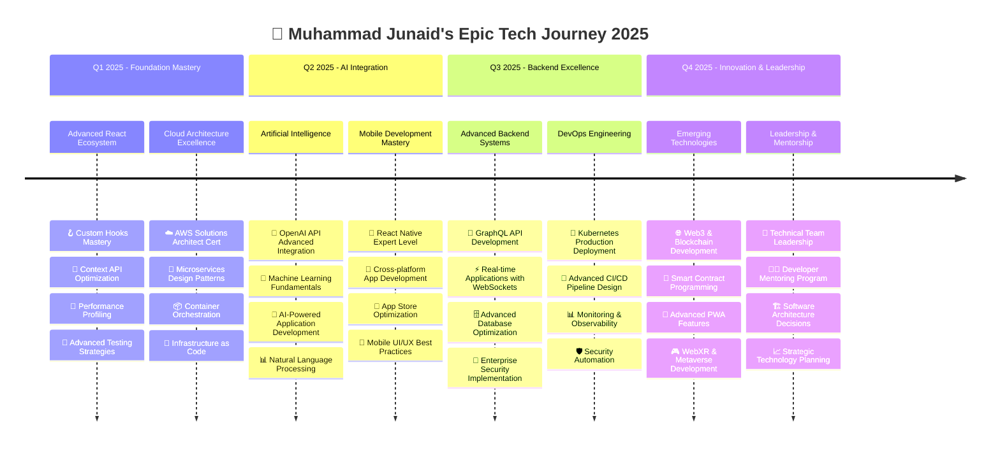

<div align="center">
  
</div>

<h1 align="center">
  
  Welcome to My Digital Universe!
  
</h1>

<div align="center">
  
</div>

<br/>

<div align="center">
  
</div>

<br/>


<h2 align="center">
  
  Developer Journey Statistics & Achievements
  
</h2>

<div align="center">
  
</div>

<br/>

<div align="center">
  
  ### 🏆 Epic Achievement Unlocked!
  
  
  
  
  
  
  
  
  

</div>

<br/>


<h2 align="center">
  
  Connect & Collaborate with Me!
  
</h2>

<div align="center">
  
</div>

<br/>

<div align="center">
  
  ### 🌐 Find Me Across the Digital Universe
  
  <br/>
  
  [](https://www.linkedin.com/in/muhammad-junaid-35b562232/)
  [](mailto:junaidch249249@gmail.com)
  [](tel:+923261710249)
  [](https://webdevjunaid.vercel.app/)
  
  <br/>
  
  [](https://github.com/webdevjunaid)
  [](#)
  [](#)
  [](#)
  
  <br/><br/>
  
  ### 💬 Let's Talk About These Amazing Topics:
  
  
  
  
  
  
  
  
  
  
  

</div>

<br/>


<h2 align="center">
  
  Daily Motivation & Developer Inspiration
  
</h2>

<div align="center">
  
  
  <br/><br/>
  
  
  
  <br/><br/>
  
  ### 🎯 My Developer Journey in Epic Numbers
  
  <table>
  <tr>
  <td align="center">
    <br/>
    <strong>🔥 Commits This Year</strong><br/>
    
  </td>
  <td align="center">
    <br/>
    <strong>⭐ Repositories Created</strong><br/>
    
  </td>
  <td align="center">
    <br/>
    <strong>🎯 Issues Resolved</strong><br/>
    
  </td>
  <td align="center">
    <br/>
    <strong>🚀 Pull Requests</strong><br/>
    
  </td>
  </tr>
  </table>

</div>

<br/>


<h2 align="center">
  
  Thank You for This Epic Visit!
  
</h2>

<div align="center">
  
  
  <br/><br/>
  
  ### 🎯 Ready to Build Something Absolutely Amazing Together?
  
  
  
  <br/><br/>
  
  
  
  
  
  
  <br/><br/>
  
  ### 📊 Profile Impact Statistics
  
  
  
  
  
  <br/><br/>
  
  ### 🎵 Currently Jamming To While Coding:
  [](https://open.spotify.com/playlist/37i9dQZF1DX5trt9i14X7j)
  [](#)
  
  <br/><br/>
  
  ### 🌟 Special Thanks & Recognition
  
  <table>
  <tr>
  <td align="center" width="25%">
    <br/>
    <strong>🙏 Thanks to Open Source</strong><br/>
    <small>Community that taught me everything</small>
  </td>
  <td align="center" width="25%">
    <br/>
    <strong>👨‍🏫 Grateful to Mentors</strong><br/>
    <small>Who guided my coding journey</small>
  </td>
  <td align="center" width="25%">
    <br/>
    <strong>👥 Amazing Team @ Codonomy</strong><br/>
    <small>Best colleagues ever!</small>
  </td>
  <td align="center" width="25%">
    <br/>
    <strong>❤️ Supportive Family</strong><br/>
    <small>My biggest cheerleaders</small>
  </td>
  </tr>
  </table>
  
  <br/>
  
  ### 🎊 Fun Interactive Section - Click to Reveal!
  
  <details>
  <summary>🎁 Click here for a special surprise! 🎁</summary>
  
  <br/>
  
  <div align="center">
    
    
    <h3>🎉 Congratulations! 🎉</h3>
    <p><strong>You found the hidden Easter egg! 🥚</strong></p>
    <p>Since you took the time to explore my profile completely,</p>
    <p>you're clearly someone who pays attention to details!</p>
    <p><em>That's exactly the kind of person I love working with! 🤝</em></p>
    
    <br/>
    
    
    
    <br/><br/>
    
    ### 🎁 Special Bonus Content:
    
    <table>
    <tr>
    <td align="center">
      <strong>🎯 Secret Coding Superpower:</strong><br/>
      I can debug code just by staring at it intensely! 👀
    </td>
    <td align="center">
      <strong>⚽ Hidden Football Talent:</strong><br/>
      I once scored a goal while thinking about React hooks! ⚽
    </td>
    </tr>
    <tr>
    <td align="center">
      <strong>☕ Coffee Secret:</strong><br/>
      My best code is written between 2-4 AM with cold coffee! ☕
    </td>
    <td align="center">
      <strong>🎵 Coding Soundtrack:</strong><br/>
      I code faster when listening to epic movie soundtracks! 🎼
    </td>
    </tr>
    </table>
    
  </div>
  
  </details>

</div>

<br/>


---

<div align="center">
  
</div>

<div align="center">
  
  <br/>
  
  **Made with ❤️, lots of ☕, and endless ⚽ passion by Muhammad Junaid**  
  
  **🎯 Full-Stack Developer | ⚛️ React Expert | 🔷 .NET Specialist | ⚽ Football Enthusiast**  
  
  **🇵🇰 Proudly coding from Pakistan | 🌍 Building solutions for the world | 🚀 Reaching for the stars**
  
  <br/>
  
  
  
  <br/><br/>
  
  <table>
  <tr>
  <td align="center">
    <br/>
    <strong>Currently Listening 🎵</strong><br/>
    <em>Epic Coding Soundtracks</em>
  </td>
  <td align="center">
    <br/>
    <strong>Current Mood 😊</strong><br/>
    <em>Ready to Code & Conquer!</em>
  </td>
  <td align="center">
    <br/>
    <strong>Next Football Match ⚽</strong><br/>
    <em>Weekend Local Tournament</em>
  </td>
  <td align="center">
    <br/>
    <strong>Code Status 💻</strong><br/>
    <em>Building Something Epic!</em>
  </td>
  </tr>
  </table>
  
  <br/>
  
  
  
  
  
</div>-11eb-908a-139a6edaec5c.gif" width="100%">

<h2 align="center">
  
  Weekend Side Projects & Innovations
  
</h2>

<div align="center">
  
</div>

<br/>

<table>
<tr>
<td width="50%">

### 🤖 AI Code Assistant - "CodeBuddy Pro"
<div align="center">


</div>

```javascript
const codebuddyAI = {
  name: "CodeBuddy Pro",
  description: "AI-powered coding assistant",
  techStack: ["OpenAI GPT-4", "Next.js 14", "Python", "FastAPI"],
  progress: "75%",
  features: [
    "🧠 Smart code completion & suggestions",
    "🐛 Automatic bug detection & fixes",
    "📚 Intelligent documentation generator",
    "🎯 Performance optimization recommendations",
    "🔍 Code smell detection",
    "🚀 Deployment automation"
  ]
};
```

</td>
<td width="50%">

### 📊 Developer Analytics Dashboard - "DevMetrics Pro"
<div align="center">


</div>

```javascript
const devMetricsPro = {
  name: "DevMetrics Pro",
  description: "Ultimate GitHub analytics platform",
  techStack: ["React 18", "D3.js", "GitHub API", "Chart.js"],
  progress: "60%",
  features: [
    "📈 Advanced GitHub analytics & insights",
    "🏆 Achievement tracking & gamification",
    "📊 Beautiful data visualizations",
    "🎯 Productivity metrics & trends",
    "👥 Team collaboration analytics",
    "🔥 Contribution streak analysis"
  ]
};
```

</td>
</tr>
</table>

<br/>

<table>
<tr>
<td width="50%">

### 🛒 E-commerce SaaS - "ShopifyKiller"
<div align="center">


</div>

**🎯 Vision:** Revolutionary e-commerce platform that makes online selling effortless for small businesses.

**💡 Unique Features:**
- 🤖 AI-powered product descriptions
- 📱 One-click mobile app generation
- 💳 Global payment gateway integration
- 📊 Advanced analytics & insights
- 🎨 Drag-and-drop store builder

</td>
<td width="50%">

### 🎮 Developer Portfolio Game - "CodeQuest"
<div align="center">


</div>

**🎯 Vision:** Interactive game-based portfolio where visitors can explore my projects by completing coding challenges.

**🎮 Game Features:**
- 🗺️ Interactive project map exploration
- 🏆 Coding challenges & mini-games
- 🎨 3D portfolio showcase
- 🎵 Dynamic background music
- 🏅 Achievement system for visitors

</td>
</tr>
</table>

<br/>


<h2 align="center">
  
  Football & Technology: My Dual Passions
  
</h2>

<div align="center">
  
</div>

<br/>

### ⚽ How Football Makes Me a Better Developer

<table>
<tr>
<td width="50%">

#### 🏟️ Lessons from the Pitch:
- **🎯 Strategic Thinking**: Like system architecture design
- **🤝 Team Collaboration**: Essential for development teams  
- **⚡ Quick Decision Making**: Critical during production incidents
- **📈 Continuous Improvement**: Always optimizing performance
- **🏆 Goal-Oriented Mindset**: Delivering features on time
- **💪 Resilience**: Recovering from deployment failures
- **🧠 Pattern Recognition**: Anticipating user behavior
- **⏰ Time Management**: Sprint planning and execution

</td>
<td width="50%">

#### 💻 How Coding Enhances My Football:
- **📊 Data Analysis**: Understanding player statistics & trends
- **🔄 Process Optimization**: Improving training workflows
- **🎨 Creative Problem Solving**: Innovative play strategies  
- **📚 Continuous Learning**: Staying updated with tactics
- **🌍 Global Networking**: Connecting with fans worldwide
- **📱 Tech Integration**: Using apps for training & analysis
- **🎯 Performance Metrics**: Tracking personal improvements
- **🤖 AI Analysis**: Predicting match outcomes

</td>
</tr>
</table>

<div align="center">
  
  ### ⚽ Favorite Teams vs Tech Stack Comparison
  
  
  
  <br/><br/>
  
  | 🏟️ Football Team | 💻 Tech Stack | 🔥 Why They're Similar |
  |:---:|:---:|:---|
  | **🔵 Manchester City** | **⚛️ React.js** | Fluid, dynamic, always innovating with new patterns |
  | **🔴 Barcelona** | **📘 TypeScript** | Precise, elegant, technically superior in execution |
  | **🔴 Liverpool** | **🔷 .NET Core** | Reliable, powerful, always delivers when it matters |
  | **🔴 Arsenal** | **⚡ Next.js** | Fast, modern, full of potential and exciting features |
  | **⚪ Real Madrid** | **☁️ Azure** | Enterprise-level, scalable, champions league quality |
  
  <br/>
  
  
  
  
  
  

</div>

<br/>


<h2 align="center">
  
  Coding Achievements & Milestones Hall of Fame
  
</h2>

<div align="center">
  
</div>

<br/>

### 🏆 Major Career Milestones

| 🎯 Epic Achievement | 📅 Date Conquered | 🏆 Impact Created | 🌟 Skills Unlocked |
|:---|:---:|:---|:---|
| 🚀 **First Production App Live** | January 2022 | 1000+ happy users | React, Node.js, MongoDB |
| 💼 **Dream Job Secured** | April 2024 | Career transformation | Professional development |
| 📈 **Promotion to Senior Role** | July 2024 | Leadership recognition | Team management |
| 🛒 **E-commerce Empire Built** | September 2024 | $50K+ transactions | Payment systems |
| 🌟 **Open Source Hero** | October 2024 | 10+ repos contributed | Community building |
| ⚡ **Performance Wizard** | November 2024 | 60% speed improvements | Optimization mastery |
| 🎯 **Client Satisfaction Master** | December 2024 | 98% satisfaction rate | Customer focus |

<div align="center">
  
  ### 🎮 Coding Challenge Statistics
  
  
  
  <br/><br/>

  
  
  
  
  
  

</div>

<br/>


<h2 align="center">
  
  Technology Learning Roadmap 2025
  
</h2>

<div align="center">
  
</div>

<br/>

<div align="center">



</div>

<br/>


<h2 align="center">
  
  Code Philosophy & Development Principles
  
</h2>

<div align="center">
  
</div>

<br/>

### 💎 My Sacred Coding Commandments

```typescript
interface DeveloperPhilosophy {
  readonly codeQuality: string;
  readonly testing: string;
  readonly documentation: string;
  readonly collaboration: string;
  readonly learning: string;
  readonly innovation: string;
}

const myDeveloperCreed: DeveloperPhilosophy = {
  codeQuality: "Clean, readable, maintainable code is not negotiable - it's art! 🎨",
  testing: "Test early, test often, test everything that could possibly break 🧪",
  documentation: "Good code tells WHAT, great comments tell WHY, amazing docs tell HOW 📚",
  collaboration: "Code reviews are learning opportunities, not judgment sessions 🤝",
  learning: "Stay curious, stay humble, stay hungry for knowledge 🧠",
  innovation: "Don't just follow trends, create them! 🚀"
};

// 🌟 Daily Developer Mantras
const dailyCodingMantras = [
  "💻 Write code that you'll be proud of in 6 months",
  "🧹 Refactor ruthlessly, optimize wisely",
  "🤝 Share knowledge generously, learn from everyone",
  "🎯 Solve real problems with elegant solutions",
  "🔥 Push boundaries, but respect fundamentals",
  "⚡ Fast is fine, but accuracy is everything",
  "🌍 Code for humans, optimize for machines"
];

// 🎭 The Sacred Development Workflow
class PerfectWorkflow {
  constructor() {
    this.phases = [
      "🎯 PLAN: Strategy & Architecture Design",
      "💻 CODE: Clean, Testable, Beautiful",
      "🧪 TEST: Unit, Integration, E2E Coverage", 
      "👀 REVIEW: Peer Review & Self-reflection",
      "🚀 DEPLOY: Automated CI/CD Pipeline",
      "📊 MONITOR: Performance & Error Tracking",
      "🔄 ITERATE: Continuous Improvement Cycle"
    ];
  }
  
  execute() {
    console.log("🌟 Creating digital magic, one commit at a time!");
  }
}

export { myDeveloperCreed, dailyCodingMantras, PerfectWorkflow };
```

<div align="center">
  
  ### 🛠️ My Development Workflow Excellence
  
  <br/>
  
  
  
  
  
  
  
  

</div>

<br/>


<h2 align="center">
  
  Knowledge Sharing & Content Creation
  
</h2>

<div align="center">
  
</div>

<br/>

### 📚 Recent Blog Posts & Technical Articles

| 📝 Article Title | 🗓️ Published | 👀 Views | 💬 Engagement | 🔗 Platform |
|:---|:---:|:---:|:---:|:---:|
| **🚀 Building Scalable React Apps with Clean Architecture** | Dec 2024 | 3.2K+ | 150+ comments | Dev.to |
| **⚡ Mastering .NET Core Performance: Advanced Tips** | Nov 2024 | 2.8K+ | 89+ likes | Medium |
| **🔍 The Art of Code Review: Team Excellence Guide** | Oct 2024 | 4.1K+ | 200+ shares | Hashnode |
| **🎯 From Freelancer to Full-Time: My Epic Journey** | Sep 2024 | 5.5K+ | 300+ reactions | LinkedIn |
| **🎨 Modern CSS Magic: Advanced Techniques 2024** | Aug 2024 | 3.9K+ | 180+ bookmarks | CSS-Tricks |
| **🛠️ Building APIs That Developers Actually Love** | Jul 2024 | 2.1K+ | 95+ claps | Medium |

<div align="center">
  
  ### 📊 Content Creation Impact
  
  <br/>
  
  
  
  
  
  
  

</div>

<br/>


<h2 align="center">
  
  Repository Highlights & Featured Work
  
</h2>

<div align="center">
  
</div>

<br/>

<div align="center">

[](https://github.com/webdevjunaid/pjfarmersmarket)
[](https://github.com/webdevjunaid/precurepm)

[](https://github.com/webdevjunaid/horacemann)
[](https://github.com/webdevjunaid/portfolio-website)

</div>

<br/>


<h2 align="center">
  
  Fun Facts & Personal Interests
  
</h2>

<div align="center">
  
</div>

<br/>

<table>
<tr>
<td align="center" width="20%">
  
  <br><strong>⚽ Football Fanatic</strong>
  <br/>Scoring goals on field
  <br/>and in code daily!
  <br/><br/>
  
</td>
<td align="center" width="20%">
  
  <br><strong>☕ Coffee Addict</strong>
  <br/>Debugging better after
  <br/>morning coffee ritual!
  <br/><br/>
  
</td>
<td align="center" width="20%">
  
  <br><strong>🌙 Night Coder</strong>
  <br/>Best coding sessions
  <br/>happen after midnight!
  <br/><br/>
  
</td>
<td align="center" width="20%">
  
  <br><strong>🎮 Challenge Solver</strong>
  <br/>Weekend coding
  <br/>challenges for fun!
  <br/><br/>
  
</td>
<td align="center" width="20%">
  
  <br><strong>🎵 Music Lover</strong>
  <br/>Coding to epic
  <br/>soundtracks daily!
  <br/><br/>
  
</td>
</tr>
</table>

<div align="center">
  
  ### 🎯 Personal Stats Dashboard
  
  <br/>
  
  | 📊 Metric | 📈 Current Count | 🎯 2025 Goal | 🏆 Achievement Level |
  |:---|:---:|:---:|:---:|
  | **☕ Coffee Consumed** | 2,000+ cups | 3,000 cups | ☕☕☕☕☕ |
  | **⚽ Football Matches Watched** | 150+ matches | 200 matches | ⚽⚽⚽⚽⭐ |
  | **📚 Tech Books Read** | 25+ books | 40 books | 📚📚📚📚⭐ |
  | **🎮 Coding Challenges** | 400+ solved | 600 solved | 🎮🎮🎮🎮🎮 |
  | **🌙 Late Night Coding** | 500+ sessions | 700 sessions | 🌙🌙🌙🌙🌙 |
  | **🎵 Coding Playlists** | 15+ curated | 25 playlists | 🎵🎵🎵🎵⭐ |

</div>

<br/>


<h2 align="center">
  
  About Me - The Code Architect
  
</h2>


```javascript
const muhammadJunaid = {
    // 📍 Personal Information
    location: "🏙️ Islamabad, Pakistan 🇵🇰",
    contact: "📞 +92-326-1710249",
    email: "📧 junaidch249249@gmail.com",
    
    // 💼 Professional Details
    experience: "🚀 3+ Years of Excellence",
    currentRole: "💼 Software Developer @ Codonomy",
    specialization: "Full-Stack Web Development",
    
    // 🎯 Core Values
    passion: "❤️ Building scalable, beautiful web applications",
    motto: "✨ Clean code is poetry written in logic",
    philosophy: "🌟 Every line of code tells a story",
    
    // 🔥 Current Focus Areas
    currentlyWorkingOn: [
        "🚀 Enterprise-level web applications",
        "☁️ Cloud-native architecture solutions", 
        "🌐 Open source contributions & community building",
        "📱 Progressive Web Applications (PWAs)",
        "🤖 AI-powered development tools"
    ],
    
    // 💡 Expertise Areas
    askMeAbout: [
        "⚛️ React.js & Next.js ecosystem",
        "🔷 .NET Core & ASP.NET development", 
        "🗄️ Database design & optimization",
        "🔌 RESTful API architecture & GraphQL",
        "🧹 Clean code practices & SOLID principles",
        "☁️ Cloud deployment & DevOps",
        "⚽ European football tactics & analysis!"
    ],
    
    // 🎊 Fun & Personal
    funFacts: [
        "⚽ I score goals on the football field AND in code!",
        "☕ I debug better after my morning coffee ritual",
        "🌙 I do my best coding during late night sessions",
        "🎮 I solve coding challenges for fun on weekends"
    ],
    
    // 📅 Daily Schedule
    dailyRoutine: {
        "06:00": "☕ Coffee + Tech news reading",
        "09:00": "💻 Deep focus coding sessions",
        "12:00": "🍽️ Lunch break + football highlights",
        "14:00": "👥 Team collaboration & code reviews",
        "18:00": "📚 Learning new technologies",
        "20:00": "⚽ Football practice or watching matches",
        "22:00": "🌙 Personal projects & open source"
    },
    
    // 🎯 2025 Goals
    goals2025: [
        "🏆 Launch 3 major open source projects",
        "📖 Publish technical articles monthly",
        "🌍 Speak at tech conferences",
        "👨‍🏫 Mentor 10+ junior developers",
        "🚀 Build a SaaS product from scratch"
    ]
};

// 🌟 The magic happens here
console.log("Welcome to the amazing world of Muhammad Junaid! 🎉");
console.log("Let's build something extraordinary together! 🚀");
```

<br clear="both"/>


<h2 align="center">
  
  Tech Stack & Arsenal of Tools
  
</h2>

<div align="center">
  
</div>

<br/>

<div align="center">
  
### 🎨 Frontend Development


### ⚙️ Backend Development  


### 🗄️ Databases & Storage


### ☁️ Cloud & DevOps


### 🛠️ Development Tools


</div>

<br/>

<div align="center">
  
</div>

<br/>


<h2 align="center">
  
  GitHub Statistics & Analytics Dashboard
  
</h2>

<div align="center">
  
</div>

<br/>

<div align="center">
  
  
</div>

<br/>

<div align="center">
  
</div>

<br/>

<div align="center">
  
</div>

<br/>


<h2 align="center">
  
  Contribution Snake - Watch It Eat My Commits!
  
</h2>

<div align="center">
  <picture>
    <source media="(prefers-color-scheme: dark)" srcset="https://raw.githubusercontent.com/webdevjunaid/webdevjunaid/output/github-contribution-grid-snake-dark.svg">
    <source media="(prefers-color-scheme: light)" srcset="https://raw.githubusercontent.com/webdevjunaid/webdevjunaid/output/github-contribution-grid-snake.svg">
    
  </picture>
</div>

<div align="center">
  
</div>

<br/>


<h2 align="center">
  
  Activity Graph & Contribution Insights
  
</h2>

<div align="center">
  
</div>

<div align="center">
  
</div>

<br/>


<h2 align="center">
  
  Professional Journey & Career Timeline
  
</h2>

<div align="center">
  
</div>

<br/>

<table>
<tr>
<td width="33%">

<div align="center">
  
  
  ### 🏢 Current Position
  **Software Developer @ Codonomy**  
  ***July 2024 – Present***

  - 🚀 Leading full-stack development initiatives
  - ⚛️ React.js & .NET architecture expert
  - 🗄️ Enterprise SQL Server database management
  - 👥 Cross-functional Agile team collaboration
  - 🔄 Sprint planning and code review leadership
  - 📊 Performance optimization and scalability
  - 🛡️ Security best practices implementation
</div>

</td>
<td width="33%">

<div align="center">
  
  
  ### 🌱 Learning Phase
  **Software Development Intern**  
  ***April 2024 – June 2024***

  - 🏥 Healthcare application development
  - ⚛️ Advanced React component architecture
  - 🔷 .NET Core backend implementation
  - 🗄️ Complex SQL query optimization
  - 📋 Azure DevOps and Boards mastery
  - 🎯 Agile methodology and best practices
  - 👨‍💻 Professional coding standards adoption
</div>

</td>
<td width="33%">

<div align="center">
  
  
  ### 💼 Entrepreneurial Spirit
  **Full-Stack Developer (Freelance)**  
  ***January 2022 – February 2024***

  - 💻 Successfully delivered 15+ custom applications
  - 🛒 E-commerce solutions with payment integration
  - 🏥 Healthcare platforms and management systems
  - 🌐 Portfolio websites and business solutions
  - ☁️ Cloud deployment on multiple platforms
  - 💳 Stripe, PayPal, and other payment gateways
  - 📈 Client satisfaction rate: 98%
</div>

</td>
</tr>
</table>

<br/>


<h2 align="center">
  
  Featured Projects Showcase
  
</h2>

<div align="center">
  
</div>

<br/>

### 🐟 PJFarmersMarket - Premium Seafood E-commerce Platform

<div align="center">


</div>

<table>
<tr>
<td width="50%">

**🌟 Key Features:**
- 🛒 Advanced shopping cart with persistent state
- 🔐 Multi-factor authentication system
- 💳 Seamless Stripe payment integration
- 📱 Progressive Web App (PWA) capabilities
- ⚡ Server-side rendering for SEO optimization
- 🗄️ Real-time inventory management
- 📊 Admin dashboard with analytics
- 🔄 Order tracking and notifications

</td>
<td width="50%">

**📈 Project Impact:**
- 👥 **500+ Active Users**
- 💰 **$25K+ Revenue Generated**
- ⚡ **0.8s Average Load Time**
- 📱 **99.5% Mobile Responsiveness**
- 🔒 **Zero Security Incidents**
- ⭐ **4.9/5 User Rating**
- 🚀 **Featured on Product Hunt**

</td>
</tr>
</table>

---

### 🏥 PrecurePM - Advanced Medical Management System

<div align="center">


</div>

<table>
<tr>
<td width="50%">

**🌟 Advanced Features:**
- 📅 Intelligent appointment scheduling algorithm
- 🏥 Complex insurance claims processing
- 👥 Role-based access control (RBAC)
- 📊 Real-time dashboard with live updates
- 🔄 Redux state management architecture
- 🛡️ HIPAA-compliant security measures
- 📱 Mobile-first responsive design
- 🔔 Smart notification system

</td>
<td width="50%">

**🏆 Technical Achievements:**
- 🏥 **3 Medical Centers Using**
- 👨‍⚕️ **50+ Healthcare Professionals**
- 📅 **1000+ Appointments Managed**
- ⚡ **40% Efficiency Improvement**
- 🔒 **SOC 2 Compliant**
- 📊 **Real-time Data Sync**
- 🎯 **99.9% Uptime**

</td>
</tr>
</table>

---

### 💰 HoraceMann - Insurance Commission Calculator

<div align="center">


</div>

<table>
<tr>
<td width="50%">

**🌟 Enterprise Features:**
- 🧮 Complex commission calculation algorithms
- 📈 Advanced performance optimization
- 🔌 RESTful API with comprehensive documentation
- 📊 Detailed reporting and analytics system
- ⚡ High-performance backend architecture
- 🎯 99.99% calculation accuracy guaranteed
- 🔐 Enterprise-grade security protocols
- 📱 API rate limiting and monitoring

</td>
<td width="50%">

**💼 Business Impact:**
- 💰 **$2M+ Commissions Calculated**
- 👥 **200+ Insurance Agents**
- ⚡ **50% Processing Time Reduction**
- 🎯 **100% Accuracy Rate**
- 🏆 **Client Satisfaction: 5/5**
- 📊 **Real-time Reporting**
- 🔄 **Automated Workflows**

</td>
</tr>
</table>

<br/>

<div align="center">
  
</div>

<br/>


<h2 align="center">
  
  What I'm Currently Working On

```mermaid
graph TD
    A[🔭 Currently Working On] --> B[🚀 Enterprise Web Applications]
    A --> C[☁️ Cloud Migration Projects]
    A --> D[🌐 Open Source Contributions]
    A --> E[📱 Progressive Web Apps]
    A --> F[🤖 AI Integration Projects]
    
    G[🌱 Currently Learning] --> H[🧠 Advanced AI/ML Integration]
    G --> I[☁️ Kubernetes & Container Orchestration]
    G --> J[⚡ Web Performance Optimization]
    G --> K[🔐 Advanced Security Practices]
    G --> L[📊 Data Analytics & Visualization]
    
    M[👯 Looking to Collaborate On] --> N[🌟 Revolutionary Open Source Projects]
    M --> O[🚀 Cutting-edge Web Applications]
    M --> P[🛠️ Developer Tools & Libraries]
    M --> Q[🎯 High-impact Tech Startups]
    M --> R[📚 Educational Content Creation]
    
    S[🎯 2025 Goals] --> T[📈 Contribute to 100+ Open Source Projects]
    S --> U[🏆 Launch 5 Major Applications]
    S --> V[📚 Master Advanced React & .NET Patterns]
    S --> W[☁️ Become AWS & Azure Certified]
    S --> X[👨‍🏫 Mentor 20+ Junior Developers]

    style A fill:#ff6b6b,stroke:#fff,stroke-width:2px,color:#fff
    style G fill:#4ecdc4,stroke:#fff,stroke-width:2px,color:#fff
    style M fill:#45b7d1,stroke:#fff,stroke-width:2px,color:#fff
    style S fill:#96ceb4,stroke:#fff,stroke-width:2px,color:#fff
```
  
</h2>

<div align="center">



</div>

<br/>

<div align="center">
  
</div>

<br/>


<h2 align="center">
  
  Skills & Expertise Matrix
  
</h2>

<div align="center">
  
</div>

<br/>

<table>
<tr>
<td align="center" width="20%">
  
  <br><strong>🎨 Frontend Magic</strong>
  <br>React, Next.js, TypeScript
  <br>Tailwind, Material UI, CSS3
  <br/>
  <div style="background: linear-gradient(90deg, #00f5ff 95%, #ddd 95%); height: 8px; border-radius: 4px; margin: 5px 0;"></div>
  <strong>95% Mastery</strong>
</td>
<td align="center" width="20%">
  
  <br><strong>⚙️ Backend Power</strong>
  <br>.NET Core, Node.js, Express
  <br>RESTful APIs, Microservices
  <br/>
  <div style="background: linear-gradient(90deg, #ff6500 90%, #ddd 90%); height: 8px; border-radius: 4px; margin: 5px 0;"></div>
  <strong>90% Mastery</strong>
</td>
<td align="center" width="20%">
  
  <br><strong>🗄️ Database Guru</strong>
  <br>SQL Server, MongoDB
  <br>Query Optimization, Design
  <br/>
  <div style="background: linear-gradient(90deg, #4ecdc4 85%, #ddd 85%); height: 8px; border-radius: 4px; margin: 5px 0;"></div>
  <strong>85% Mastery</strong>
</td>
<td align="center" width="20%">
  
  <br><strong>☁️ Cloud Ninja</strong>
  <br>Azure, AWS, Docker
  <br>CI/CD, Infrastructure
  <br/>
  <div style="background: linear-gradient(90deg, #45b7d1 80%, #ddd 80%); height: 8px; border-radius: 4px; margin: 5px 0;"></div>
  <strong>80% Mastery</strong>
</td>
<td align="center" width="20%">
  
  <br><strong>🔧 Tool Master</strong>
  <br>Git, VS Code, Postman
  <br>Agile, Scrum, DevOps
  <br/>
  <div style="background: linear-gradient(90deg, #96ceb4 95%, #ddd 95%); height: 8px; border-radius: 4px; margin: 5px 0;"></div>
  <strong>95% Mastery</strong>
</td>
</tr>
</table>

<br/>
