#  Hello World! I'm Muhammad Junaid

<div align="center">
  
</div>

<br/>

<div align="center">
  
</div>

## 🚀 About Me

```javascript
const junaid = {
    location: "Islamabad, Pakistan 🇵🇰",
    contact: "+92-326-1710249",
    email: "junaidch249249@gmail.com",
    experience: "3+ Years",
    currentRole: "Software Developer @ Codonomy",
    passion: "Building scalable web applications",
    motto: "Clean code is not written by following a set of rules. You know you are working on clean code when each routine turns out to be pretty much what you expected.",
    
    currentlyWorkingOn: [
        "Full-stack web applications",
        "Enterprise solutions",
        "Open source contributions"
    ],
    
    askMeAbout: [
        "React/Next.js", ".NET", "Full-stack development",
        "Database design", "API architecture", "Clean code practices"
    ],
    
    funFact: "I love football and building personal software tools! ⚽"
};
```

<br/>


## 🛠️ Technology Arsenal

<div align="center">
  <h3>Frontend Development</h3>
  
  <br/><br/>
  
  <h3>Backend Development</h3>
  
  <br/><br/>
  
  <h3>Databases & Cloud</h3>
  
  <br/><br/>
  
  <h3>Tools & Platforms</h3>
  
</div>

<br/>


## 📊 GitHub Analytics

<div align="center">
  
  
</div>

<div align="center">
  
</div>

<br/>

<div align="center">
  
</div>

<br/>


## 💼 Professional Journey

<table>
<tr>
<td width="50%">

### 🏢 Current Position
**Software Developer @ Codonomy**  
*July 2024 – Present*

- 🚀 Leading full-stack development using React.js & .NET
- 🗄️ Managing SQL Server databases for enterprise apps
- 👥 Collaborating with cross-functional teams
- 🔄 Participating in Agile/Scrum processes

</td>
<td width="50%">

### 🌱 Previous Experience
**Software Development Intern @ Codonomy**  
*April 2024 – June 2024*

**Full-Stack Developer (Freelance)**  
*January 2022 – February 2024*

- 💻 Built 15+ custom web applications
- 🛒 E-commerce, healthcare, and portfolio solutions
- 🌐 Deployed on Vercel, Netlify, and Render

</td>
</tr>
</table>

<br/>


## 🏆 Featured Projects

<div align="center">

### 🐟 PJFarmersMarket - Seafood E-commerce Platform


*A full-featured online seafood marketplace with secure authentication, shopping cart, and payment processing*

---

### 🏥 PrecurePM - Medical Appointment System


*Internal medical platform for appointment scheduling and insurance claims with role-based access control*

---

### 💰 HoraceMann - Insurance Commission Backend


*Backend infrastructure for calculating agent commissions with high accuracy and performance optimization*

</div>

<br/>


## 📈 Contribution Graph

<div align="center">
  
</div>

<br/>


## 🎯 What I'm Up To

```mermaid
graph TD
    A[🔭 Currently Working On] --> B[Full-stack Web Applications]
    A --> C[Enterprise Solutions]
    A --> D[Open Source Projects]
    
    E[🌱 Currently Learning] --> F[Advanced React Patterns]
    E --> G[Cloud Architecture]
    E --> H[AI Integration]
    
    I[👯 Looking to Collaborate On] --> J[Open Source Projects]
    I --> K[Innovative Web Apps]
    I --> L[Developer Tools]
```

<div align="center">



</div>

<br/>


## 🏃‍♂️ Quick Facts

<div align="center">

| 🎓 Education | 📍 Location | ⚽ Passion | 🎯 Focus |
|:---:|:---:|:---:|:---:|
| BS from University of Agriculture, Faisalabad | Islamabad, Pakistan | Football & Tech | Clean Code & Innovation |

</div>

<table align="center">
<tr>
<td align="center" width="25%">
  
  <br><strong>Code Quality</strong>
  <br>Writing clean, maintainable code
</td>
<td align="center" width="25%">
  
  <br><strong>Problem Solving</strong>
  <br>Tackling complex challenges
</td>
<td align="center" width="25%">
  
  <br><strong>Learning</strong>
  <br>Always exploring new tech
</td>
<td align="center" width="25%">
  
  <br><strong>Collaboration</strong>
  <br>Working with amazing teams
</td>
</tr>
</table>

<br/>


## 🤝 Let's Connect!

<div align="center">
  
  [](https://www.linkedin.com/in/muhammad-junaid-35b562232/)
  [](mailto:junaidch249249@gmail.com)
  [](tel:+923261710249)
  [](https://webdevjunaid.vercel.app/)

</div>

<br/>

<div align="center">
  <h3>💭 Quote of the Day</h3>
  
</div>

<br/>

<div align="center">
  
</div>

---

<div align="center">
  
  
  
</div>

<div align="center">
  Made with ❤️ by Muhammad Junaid | Full-Stack Developer from Pakistan 🇵🇰
</div>
